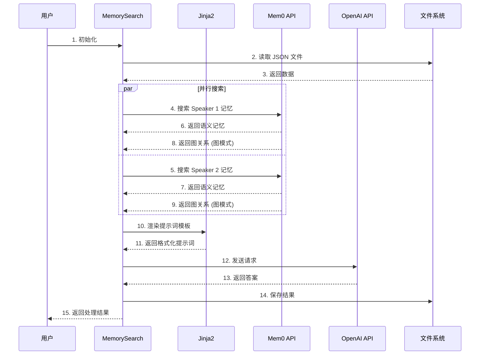

# MemorySearch 时序图 (Mermaid)

```mermaid
sequenceDiagram
    participant User as 用户
    participant MS as MemorySearch
    participant J2 as Jinja2
    participant M0 as Mem0 API
    participant OAI as OpenAI API
    participant FS as 文件系统
    
    User->>MS: 1. 初始化
    MS->>FS: 2. 读取 JSON 文件
    FS-->>MS: 3. 返回数据
    
    par 并行搜索
        MS->>M0: 4. 搜索 Speaker 1 记忆
        M0-->>MS: 6. 返回语义记忆
        M0-->>MS: 8. 返回图关系 (图模式)
    and
        MS->>M0: 5. 搜索 Speaker 2 记忆
        M0-->>MS: 7. 返回语义记忆
        M0-->>MS: 9. 返回图关系 (图模式)
    end
    
    MS->>J2: 10. 渲染提示词模板
    J2-->>MS: 11. 返回格式化提示词
    
    MS->>OAI: 12. 发送请求
    OAI-->>MS: 13. 返回答案
    
    MS->>FS: 14. 保存结果
    MS-->>User: 15. 返回处理结果
```

## 如何使用
访问 https://mermaid.live/ 在线渲染