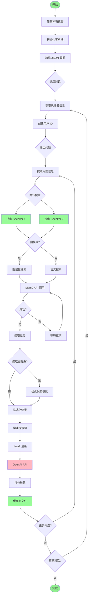

# MemorySearch Mermaid 流程图

```mermaid
flowchart TB
    Start([开始]) --> LoadEnv[加载环境变量]
    LoadEnv --> InitClients[初始化客户端]
    InitClients --> LoadData[加载 JSON 数据]
    
    LoadData --> ConvLoop{遍历对话}
    ConvLoop --> GetSpeaker[获取说话者信息]
    GetSpeaker --> CreateIDs[创建用户 ID]
    CreateIDs --> QALoop{遍历问题}
    
    QALoop --> ExtractQ[提取问题信息]
    ExtractQ --> SearchParallel{并行搜索}
    
    SearchParallel --> Search1[搜索 Speaker 1]
    SearchParallel --> Search2[搜索 Speaker 2]
    
    Search1 --> CheckMode{图模式?}
    Search2 --> CheckMode
    
    CheckMode -->|是| GraphSearch[图记忆搜索]
    CheckMode -->|否| SemanticSearch[语义搜索]
    
    GraphSearch --> APICall[Mem0 API 调用]
    SemanticSearch --> APICall
    
    APICall --> CheckSuccess{成功?}
    CheckSuccess -->|是| ExtractMem[提取记忆]
    CheckSuccess -->|否| Retry[等待重试]
    Retry --> APICall
    
    ExtractMem --> ExtractGraph{提取图关系?}
    ExtractGraph -->|是| FormatGraph[格式化图记忆]
    ExtractGraph -->|否| FormatRes[格式化结果]
    FormatGraph --> FormatRes
    
    FormatRes --> BuildPrompt[构建提示词]
    BuildPrompt --> RenderTemplate[Jinja2 渲染]
    RenderTemplate --> OpenAICall[OpenAI API]
    OpenAICall --> Package[打包结果]
    Package --> Save[保存到文件]
    
    Save --> MoreQA{更多问题?}
    MoreQA -->|是| ExtractQ
    MoreQA -->|否| MoreConv{更多对话?}
    MoreConv -->|是| GetSpeaker
    MoreConv -->|否| Exit([完成])
    
    style Start fill:#90EE90
    style Exit fill:#90EE90
    style Search1 fill:#98FB98
    style Search2 fill:#98FB98
    style OpenAICall fill:#FFB6C1
    style Save fill:#98FB98
```

## 如何使用
1. 将以上代码复制到支持 Mermaid 的编辑器中（如 GitHub、Typora 等）
2. 或访问 https://mermaid.live/ 在线渲染
3. 可以导出为 PNG、SVG 等格式